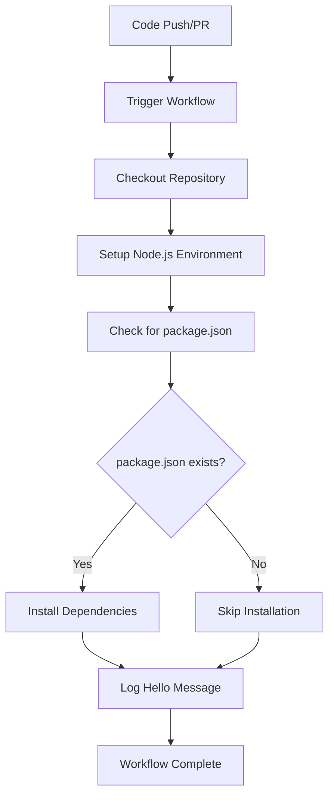

# Build-a-GitHub-Actions-Pipeline
# GitHub Actions Node.js Hello World Workflow

This repository contains a basic GitHub Actions workflow that demonstrates continuous integration (CI) setup with Node.js environment configuration and custom message logging.

## 🎯 Project Overview

This project showcases a fundamental GitHub Actions workflow that:
- Sets up a Node.js development environment
- Performs basic repository operations
- Logs a personalized greeting message
- Demonstrates CI/CD best practices

## 📁 Repository Structure

```
.
├── .github/
│   └── workflows/
│       └── hello-world.yml    # Main workflow file
├── README.md                  # This documentation
└── package.json              # Optional Node.js dependencies
```

## 🔧 Workflow Approach

### Architecture Overview

The workflow follows a **declarative approach** using YAML configuration to define automated processes that run in GitHub's cloud infrastructure.

### Key Components

1. **Trigger Configuration**
   - Event-driven execution on `push` and `pull_request` events
   - Branch-specific targeting (`main`, `master`)
   - Ensures workflow runs on relevant code changes

2. **Environment Setup**
   - Ubuntu-based runner for consistent execution environment
   - Node.js v18 installation with npm caching
   - Cross-platform compatibility considerations

3. **Execution Steps**
   - Sequential step execution with dependency management
   - Error handling and conditional logic
   - Logging and output generation

### Workflow Strategy

#### 1. **Event-Driven Automation**
```yaml
on:
  push:
    branches: [ main, master ]
  pull_request:
    branches: [ main, master ]
```
- **Purpose**: Automatically trigger on code changes
- **Benefits**: Immediate feedback on code quality
- **Scalability**: Supports multiple branch strategies

#### 2. **Environment Consistency**
```yaml
runs-on: ubuntu-latest
```
- **Rationale**: Provides reproducible execution environment
- **Advantages**: Cost-effective, well-supported, fast startup
- **Alternatives**: Windows, macOS runners available

#### 3. **Node.js Setup Strategy**
```yaml
uses: actions/setup-node@v4
with:
  node-version: '18'
  cache: 'npm'
```
- **Version Management**: Pinned to stable LTS version
- **Performance**: Npm cache reduces build times
- **Compatibility**: Supports modern JavaScript features

#### 4. **Conditional Dependency Management**
```bash
if [ -f package.json ]; then
  npm ci
else
  echo "No package.json found, skipping npm install"
fi
```
- **Flexibility**: Works with or without Node.js dependencies
- **Reliability**: Uses `npm ci` for deterministic installs
- **Error Prevention**: Graceful handling of missing files

## 🚀 Implementation Guide

### Step 1: Repository Setup

1. Create a new GitHub repository or use an existing one
2. Clone the repository to your local machine:
   ```bash
   git clone https://github.com/YOUR_USERNAME/YOUR_REPO_NAME.git
   cd YOUR_REPO_NAME
   ```

### Step 2: Workflow Configuration

1. Create the workflow directory structure:
   ```bash
   mkdir -p .github/workflows
   ```

2. Create the workflow file:
   ```bash
   touch .github/workflows/hello-world.yml
   ```

3. Copy the workflow content and customize:
   - Replace `YOUR_GITHUB_USERNAME` with your actual GitHub username
   - Modify branch names if using different conventions
   - Adjust Node.js version if needed

### Step 3: Deployment

1. Commit and push the workflow:
   ```bash
   git add .github/workflows/hello-world.yml
   git commit -m "Add GitHub Actions workflow"
   git push origin main
   ```

2. Monitor execution:
   - Navigate to repository → Actions tab
   - View workflow runs and logs
   - Debug any issues using the detailed logs

## 📊 Workflow Execution Flow



## 🔍 Benefits and Use Cases

### Immediate Benefits
- **Automated Testing**: Foundation for adding test suites
- **Environment Validation**: Ensures code works in clean environments
- **Documentation**: Provides executable documentation of setup process
- **Team Collaboration**: Standardizes development environment

### Extended Use Cases
- **Continuous Integration**: Add linting, testing, and building steps
- **Deployment Pipeline**: Extend to staging and production deployments
- **Quality Gates**: Implement code quality checks and security scanning
- **Multi-Environment Testing**: Test across different Node.js versions

## 🛠️ Customization Options

### Environment Variables
```yaml
env:
  NODE_ENV: development
  CUSTOM_MESSAGE: "Hello from CI/CD!"
```

### Matrix Strategy (Multiple Versions)
```yaml
strategy:
  matrix:
    node-version: [16, 18, 20]
```

### Conditional Execution
```yaml
if: github.event_name == 'push'
```

## 🔧 Troubleshooting

### Common Issues

1. **Workflow Not Triggering**
   - Check branch names in trigger configuration
   - Verify workflow file is in correct location
   - Ensure proper YAML syntax

2. **Permission Errors**
   - Check repository permissions
   - Verify GitHub Actions is enabled
   - Review workflow permissions settings

3. **Node.js Setup Failures**
   - Verify Node.js version availability
   - Check for syntax errors in workflow file
   - Review runner compatibility

### Debug Strategies

1. **Enable Debug Logging**
   ```yaml
   env:
     ACTIONS_STEP_DEBUG: true
   ```

2. **Add Diagnostic Steps**
   ```yaml
   - name: Debug Environment
     run: |
       echo "Node version: $(node --version)"
       echo "Npm version: $(npm --version)"
       echo "Working directory: $(pwd)"
       ls -la
   ```

## 📈 Performance Considerations

### Optimization Techniques
- **Caching**: Leverage npm cache for faster builds
- **Parallelization**: Use job matrices for concurrent execution
- **Minimal Images**: Use specific runner images when possible
- **Selective Triggers**: Limit workflow execution to relevant changes

### Resource Management
- **Execution Time**: Monitor and optimize workflow duration
- **Storage Usage**: Clean up artifacts and cache regularly
- **API Limits**: Be aware of GitHub Actions usage limits

## 🔄 Next Steps

### Immediate Enhancements
1. Add unit testing framework (Jest, Mocha)
2. Implement code linting (ESLint, Prettier)
3. Add build processes (Webpack, Vite)
4. Include security scanning (npm audit, Snyk)

### Advanced Features
1. **Multi-stage Deployments**: Staging and production environments
2. **Integration Testing**: Database and API testing
3. **Performance Monitoring**: Automated performance regression detection
4. **Notification Systems**: Slack, email, or webhook notifications

## 📚 Additional Resources

- [GitHub Actions Documentation](https://docs.github.com/en/actions)
- [Node.js Setup Action](https://github.com/actions/setup-node)
- [Workflow Syntax Reference](https://docs.github.com/en/actions/using-workflows/workflow-syntax-for-github-actions)
- [CI/CD Best Practices](https://docs.github.com/en/actions/learn-github-actions/essential-features-of-github-actions)

